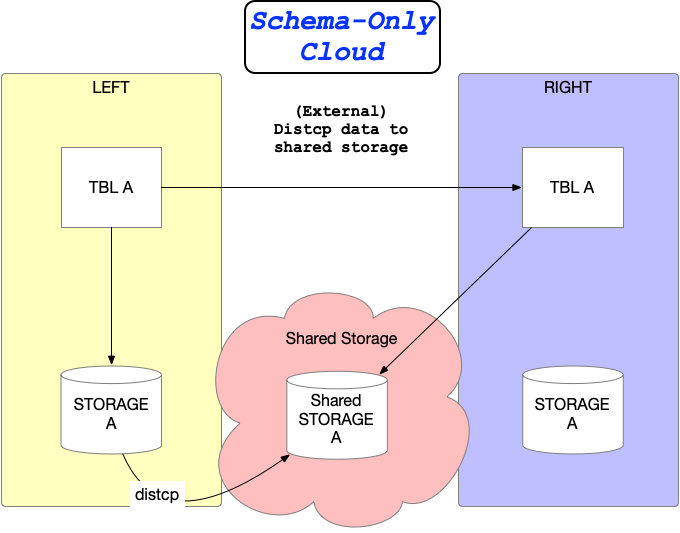

# SCHEMA_ONLY

This strategy is used to migrate "only" the schema (mostly).  When migrating from a `legacy` (Hive 1/2) hive environment to a `non-legacy` (Hive 3+) `hms-mirror` will convert tables that are "managed non-transactional" to "external/purge".  This translation is a part of the HSMM (Hive Strict Managed Migration) process that run for 'in-place' upgrades.

`hms-mirror` is mostly designed for "side-car" migrations which involves two separate clusters.

### Options

#### `-f|--flip`

The configuration yaml has two clusters defined: LEFT and RIGHT.  By default, all work moves from LEFT to RIGHT.  If you need to perform actions from RIGHT to LEFT, use the `-f` option to switch these clusters.  The final report will show that these clusters have been reversed.

#### `-ma|--migrate-acid` or `-mao|--migrate-acid-only`  \[optional artificial bucket limit\] \(default is 2\)

The default behaviour is NOT to handle ACID tables.  ACID tables require some additional handling.  When you need to address ACID tables, use these flags to either include them OR migrate ONLY ACID tables.

Migrations from legacy hive environments may have had to create tables with an unnecessary `CLUSTERED BY` clause to support `bucketing` for these ACID tables.  The `artificial bucket limit` is an opportunity to remove those definitions for the migrated tables.  For example: If you've defined a table with 2 buckets, the default `artificial bucket limit` is 2, so the table `CLUSTERED BY ... INTO 2 BUCKETS` will be removed from the definition.

#### [`-mnno|--migrate-non-native-only`](hms-mirror-intro.md#non-native-hive-tables-hbase-kafka-jdbc-druid-etc)

Use this to migrate *non-native* hive tables like: Kafka, HBase, JDBC Federated, etc..  This option excludes *native* tables from processing, so you should run it separately.

Note that many of these tables **REQUIRE** that the supporting references **EXIST** first, or their creation will **FAIL**.  For instance, migrating a table with the HBase Storage handler requires that the HBase table is *present* AND *visible* from Hive.

#### [`-v|--views-only`](hms-mirror-intro.md#views)

Like `-mnno` the `-v` option excludes other tables from processing, so it's designed to run along.  And like the `-mnno` option, it too requires the supporting tables to exist, otherwise the view create statements will *fail*.

#### `-asm|--avro-schema-migration`

AVRO tables have a `TBLPROPERTIES` key `avro.schema.url` that identifies the supporting avro schemas location on the current cluster.  When migrating AVRO tables, use this option to check for this setting.  As a result, `hms-mirror` will parse out the location and replace it with the same relative location.

`hms-mirror` will use the configured environments `hdfs|core-site.xml` files to launch an `hdfs` client that will copy the supporting avro schema between clusters. For this to work, the clusters MUST be [visible to each other](Linking-Cluster-Storage-Layers.md).

The DUMP strategy is like SCHEMA_ONLY; it just doesn't require the RIGHT cluster to be connected.  Although, it does need the following settings for the RIGHT cluster to make the proper adjustments:
```
legacyHive
hcfsNamespace
hiveServer2 -> partitionDiscovery 
```

When the option `-ma` (migrate acid) is specified, the ACID schema's will be migrated/dumped.  It is essential to know that the data for ACID tables can NOT simply be copied from one clusters hive instance to another.  The data needs to be extracted to a none ACID table, then use an external table definition to read and INSERT the data into the new ACID table on the RIGHT cluster.  For those that insist on trying to simply copy the data.... you've been warned ;).

With the DUMP strategy, you'll have a 'translated' (for legacy hive) table DDL that can be run on the new cluster independently.



